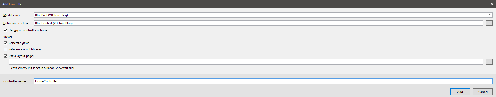

# Step By Step Guide

## Create Site See [Create site issue](https://github.com/VBDev2Dev/VBStore/pull/3)
1. Create ASP.Net MVC site    
1. Choose bootstrap theme and update bootstrap files with new css files.  I chose [Cyborg from bootswatch](https://bootswatch.com/cyborg/)

## Setup Migrations
1. Enable migrations.  This will let us use code first migrations. Read about them [here]() 
1. Add initial migration. 
1. Update web config to have database names desired.

## Setup Roles
1. Add default role seeding to create the roles if needed.
1. Run update-database to apply code migrations and get roles in db.
1. Add new users to default role.

## Blog
1. Add Blog Area 
1. Add Model for BlogPost.
1. Add EF context for Blog
    1. 
    1. 
1. Add Migration configuration for Blog context 
1. Add Inital migration 
1. Add HomeController to Blog Area
    1. 
    1. 
    1. 